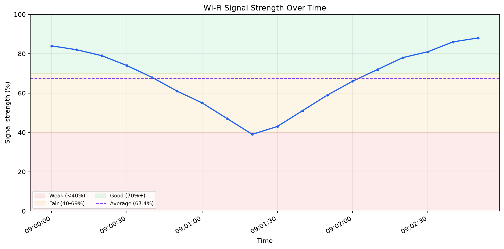

# Wi-Fi Signal Logger

A small Windows networking project that records Wi-Fi signal strength, stores
readings in CSV, prints summary statistics, and creates a PNG chart. It is a
portfolio-friendly example of command-line automation, Windows troubleshooting,
privacy-aware data collection, testing, and basic data visualization.



## Features

- Reads the connected adapter with the built-in `netsh` Windows command.
- Records signal strength, channel, radio type, link rates, and a timestamp.
- Uses anonymous, repeatable labels for SSIDs and BSSIDs by default.
- Appends standards-compliant CSV data that opens in Excel or Google Sheets.
- Creates a color-banded PNG chart and a terminal summary report.
- Handles disconnections, permission errors, and Ctrl+C cleanly.
- Includes offline fixtures, automated tests, and GitHub Actions CI.

## Requirements

- Windows 10 or Windows 11 for live collection
- Python 3.10 or newer
- An active Wi-Fi connection

Charting uses Matplotlib. Collection and CSV reporting use only Python's
standard library.

## Quick start

Open PowerShell in this folder, then run:

```powershell
py -m venv .venv
.\.venv\Scripts\Activate.ps1
python -m pip install -r requirements.txt
python wifi_logger.py once
```

Log one reading every five seconds for five minutes:

```powershell
python wifi_logger.py log
```

Create a report and chart:

```powershell
python wifi_logger.py report
python wifi_logger.py chart
```

The defaults are `data/wifi_signal.csv` and `outputs/wifi_signal.png`.

## Commands

```text
python wifi_logger.py once
python wifi_logger.py log [--interval SECONDS] [--duration SECONDS] [--output FILE]
python wifi_logger.py report [--input FILE]
python wifi_logger.py chart [--input FILE] [--output FILE]
```

Examples:

```powershell
# Record for 30 minutes, once every 10 seconds
python wifi_logger.py log --interval 10 --duration 1800

# Run until Ctrl+C
python wifi_logger.py log --duration 0

# Analyze a different file
python wifi_logger.py report --input examples/sample_wifi_signal.csv

# Make a chart from the included sample data
python wifi_logger.py chart --input examples/sample_wifi_signal.csv --output sample.png
```

After installing the project with `python -m pip install -e .`, the equivalent
`wifi-signal-logger` command is also available.

## Privacy

Network names can reveal personal information. By default, the program replaces
the SSID and BSSID with stable SHA-256-based labels such as
`network-a1b2c3d4e5`. This lets repeated readings be grouped without publishing
the real identifiers.

To deliberately display or save the real SSID and BSSID, add
`--include-identifiers` to `once` or `log`. The `data/` CSV files and generated
`outputs/` charts are ignored by Git so personal readings are not committed by
accident.

## CSV columns

| Column | Description |
| --- | --- |
| `timestamp` | Local ISO 8601 time with timezone |
| `interface` | Windows adapter name |
| `state` | Connection state |
| `ssid`, `bssid` | Anonymous labels by default |
| `signal_percent` | Signal quality from 0 to 100 |
| `channel` | Current Wi-Fi channel |
| `radio_type` | Wi-Fi standard reported by Windows |
| `authentication`, `cipher` | Connection security information |
| `receive_mbps`, `transmit_mbps` | Negotiated link rates |

Signal percentage is the quality value reported by Windows; it is not a direct
dBm measurement.

## Troubleshooting

**`No connected Wi-Fi interface was found`**

Connect to Wi-Fi, disable airplane mode, and try `python wifi_logger.py once`
again. Ethernet does not count as a Wi-Fi connection.

**`Windows denied access to Wi-Fi interface details` or error 5**

First try a normal interactive PowerShell or Command Prompt. On managed devices,
local policy may require an Administrator terminal. You can verify the underlying
command directly with `netsh wlan show interfaces`.

**`The Windows WLAN AutoConfig service is not running`**

Open `services.msc`, locate **WLAN AutoConfig**, and start it if your device
policy permits.

**PowerShell blocks `Activate.ps1`**

Activation is optional. Run the virtual environment directly:

```powershell
.\.venv\Scripts\python.exe -m pip install -r requirements.txt
.\.venv\Scripts\python.exe wifi_logger.py once
```

**Charting says Matplotlib is missing**

Run `python -m pip install -r requirements.txt` using the same Python that runs
the logger.

## Development

```powershell
py -m venv .venv
.\.venv\Scripts\python.exe -m pip install -r requirements-dev.txt
.\.venv\Scripts\python.exe -m pytest -v
```

All collector tests use saved, privacy-safe `netsh` output. CI does not need
access to a real wireless adapter.

## Project layout

```text
wifi-signal-logger/
|-- wifi_logger.py                 # Simple entry point
|-- wifi_signal_logger/            # Application package
|-- tests/                         # Unit and CLI tests
|-- examples/sample_wifi_signal.csv
|-- docs/sample-chart.png
|-- .github/workflows/test.yml
|-- pyproject.toml
`-- README.md
```

## Version 1 scope

Version 1 targets English-language Windows `netsh` output and charts a single
connected interface. A future version could use the Windows Native Wi-Fi API,
support localized Windows installations, add scheduled logging, and create an
interactive dashboard.

## License

MIT
